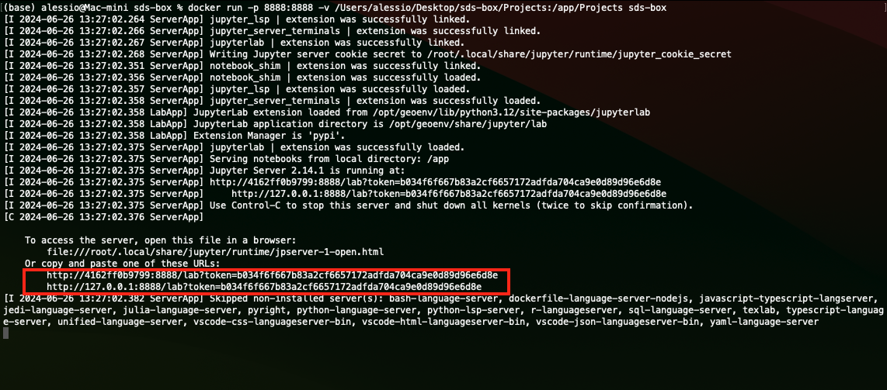
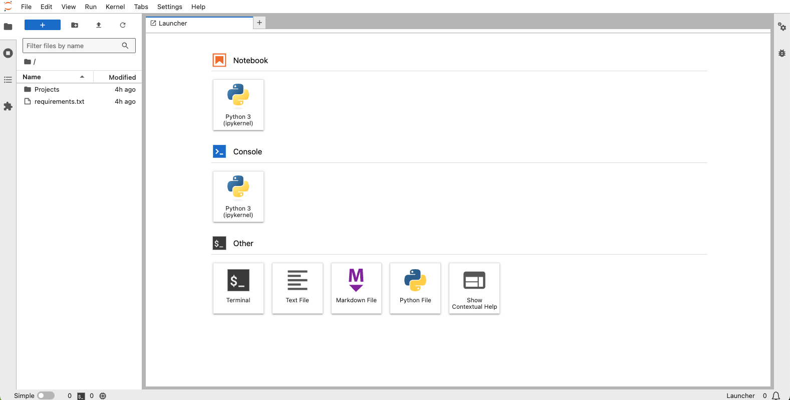

# sds-box
Template per container orientato alla **Spatial Data Science** con Python, comprensivo delle principali librerie e di un ambiente **JupyterLab**.

### Perché?
 * La containerizzazione garantisce un ambiente JupyterLab coerente, eliminando i problemi di compatibilità
 * JupyterLab containerizzato semplifica la condivisione e la collaborazione eliminando la necessità di configurare manualmente l'ambiente

### Requisiti
L'unico requisito è avere Docker sul proprio computer

## Creazione del container
 * Lanciare Docker
 * Scaricare ed estrarre (o clonare) il repository in locale
 * Da terminale, spostarsi nella cartella scaricata ed eseguire la build
   
```
docker build . -t sds-box
```

La label <mark>sds-box</mark> può essere sostituita a piacimento, per esempio col nome del progetto per la quale la si vuole utilizzare.

## Avvio dell'ambiente Jupyter

### Per giocare
Una volta creato il container (la prima volta potrebbe volerci qualche minuto dovuto all'installazione delle dipendenze) è possibile eseguirlo lanciando questo comando:

```
docker run -p 8888:8888 sds-box
```

Il terminale mostrerà un link che, una volta aperto nel browser, darà accesso all'ambiente Jupyter:



### Per fare sul serio (mappare i volumi)
Per un utilizzo reale è il caso di mappare nel container una directory del sistema locale, ad esempio la directory del progetto su cui stiamo lavorando! 
Supponiamo di aver scaricato sds-box sul desktop, possiamo lanciarla in questo modo:

```
docker run -p 8888:8888 -v /Users/alessio/Desktop/sds-box/Projects:/app/Projects sds-box
```

Così facendo mapperemo la cartella "Projects" e tutte le sue sottocartelle all'interno del container e tutti i file e le cartelle che inseriremo in Projects resteranno in maniera persistente sulla nostra macchina. 
All'interno della cartella Projects fornita col repository troverete dei notebook di esempio. 
Ovviamente potete mappare qualunque altra cartella!



### Personalizzazione
Il template è fatto in modo tale da poter essere personalizzato in modo piuttosto semplice. Aggiungi (o rimuovi!) i pacchetti che ti interessano modificando il file _requirements.txt_ e ricrea il container.

```
docker build . -t sds-box
```

### Crediti
L'idea di questo repository è nata dalla lettura di:

 * https://docs.docker.com/guides/use-case/jupyter/
 * https://www.geocorner.net/post/don-t-install-python-for-data-science-use-docker-instead
 * https://www.geocorner.net/post/configuring-a-minimal-docker-image-for-spatial-analysis-with-python
 * https://medium.com/@18bhavyasharma/setting-up-and-running-jupyter-notebook-in-a-docker-container-d2acd713ce66
